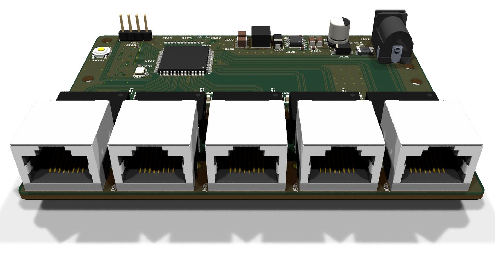
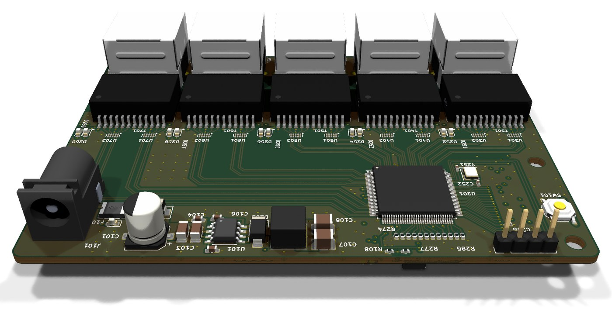
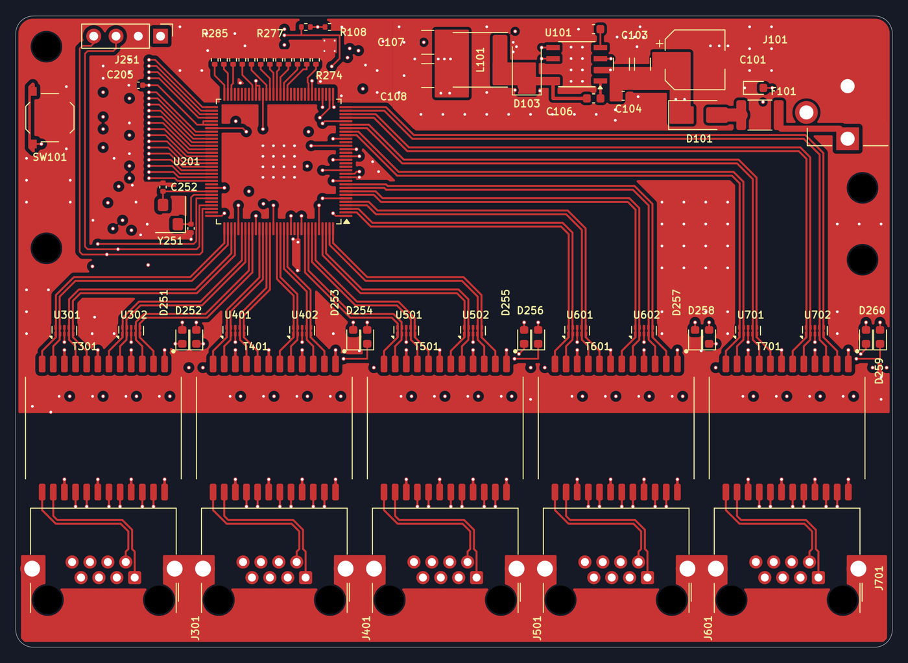
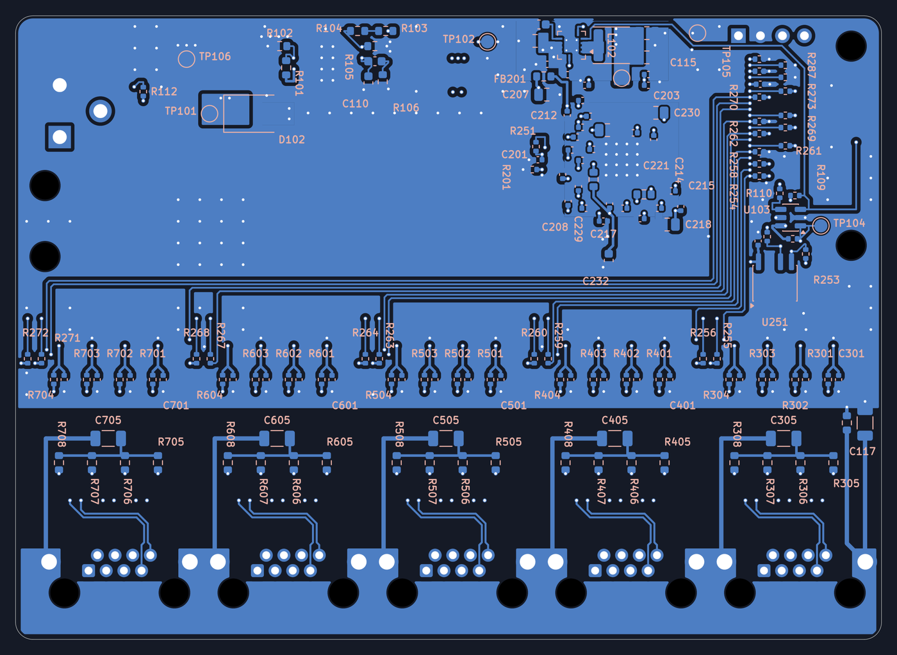
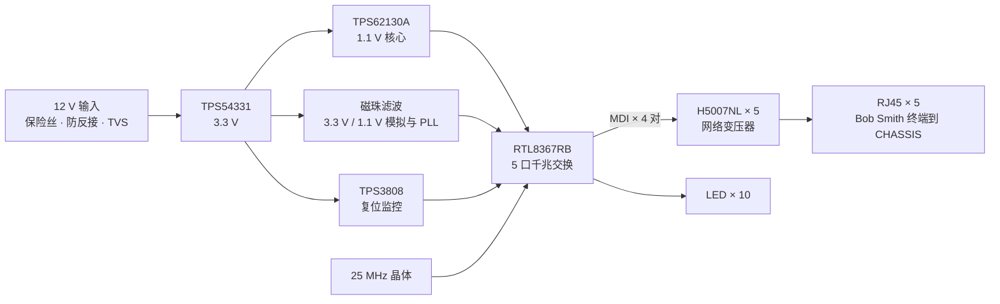

# RTL8367 Switch

**RTL8367RB 五口千兆非网管交换机**

[](LICENSE)


> An open-source five-port gigabit Ethernet switch built around the Realtek RTL8367RB. It is unmanaged: the
> chip boots from strap pins and needs no MCU. Each port has a discrete Pulse H5007NL magnetics module, a shielded RJ45
> and two status LEDs. A 12 V input feeds two on-board bucks, 3.3 V (TPS54331) and 1.1 V (TPS62130A).
> The board is a compact 100 × 72 mm, 4-layer KiCad 10 design, assembled on both sides, with complete fabrication
> outputs. **v0.1 has not been built or tested yet.**

| 正面（网口一侧） | 背面（电源一侧） |
|---|---|
|  |  |

### PCB 走线

| 顶层 F.Cu | 底层 B.Cu（从背面看） |
|---|---|
|  |  |

第 2 层整层是地，第 3 层是电源分区；图里只画了两个外层。

---

## 目录

- [主要指标](#主要指标)
- [系统结构](#系统结构)
- [仓库结构](#仓库结构)
- [打开工程](#打开工程)
- [打样与装配](#打样与装配)
- [设计要点](#设计要点)
- [状态与待验证项](#状态与待验证项)
- [许可证](#许可证)
- [致谢](#致谢)

## 主要指标

| 项 | 值 |
|---|---|
| 交换芯片 | Realtek RTL8367RB-VB-CG（LQFP-128，带散热焊盘） |
| 端口 | 5 × 10/100/1000BASE-T，RJ45 带屏蔽壳 |
| 管理 | 非网管，靠 strap 引脚配置；预留 SMI 调试口（J251）和 EEPROM 位置（默认不贴） |
| 网络变压器 | Pulse H5007NL × 5（每口一颗，分立） |
| 指示灯 | 每口一绿一黄，外加一颗电源灯 |
| 输入 | 12 V DC，5.5 × 2.1 mm 插座（CUI PJ-102AH） |
| 输入保护 | 自恢复保险丝 0.75 A（1812L075/33DR）、防反接肖特基 SS34、TVS SMBJ15A |
| 3.3 V | TPS54331 降压，6.8 µH，SS34 续流 |
| 1.1 V（芯片核心） | TPS62130A 降压，2.2 µH，放在背面，紧靠芯片 |
| 复位 | TPS3808G30 监控 3.3 V，带手动复位按键 |
| 时钟 | 25 MHz 晶体 |
| PCB | 100 × 72 mm，4 层，1.58 mm，嘉立创叠层 JLC04161H-3313A（外层 1 oz，内层 0.5 oz） |
| 装配 | 双面贴片：正面 56 个、背面 129 个，共 185 个 |

## 系统结构



- 5 个网口都用芯片内置的 PHY，MDI 从芯片直连变压器，中间没有其他器件。
- 变压器芯片侧的中心抽头各接 0.1 µF 到地，另外预留一个 0 Ω 到 +3V3A 的位置（默认不贴）。
- 线缆侧中心抽头各经 75 Ω 汇到一点，再经 1 nF / 2 kV 接屏蔽地 CHASSIS（Bob Smith 终端）。CHASSIS 与 GND 之间有一颗 1 nF 电容。
- 每对差分线旁预留了 ESD 保护（TPD4E02B04，默认不贴）。

更完整的说明见 [docs/design.md](docs/design.md)。

## 仓库结构

```
.
├── rtl8367-switch.kicad_pro   KiCad 工程
├── *.kicad_sch                原理图：根页 + 电源、芯片供电、芯片控制、5 个网口
├── rtl8367-switch.kicad_pcb   PCB
├── lib/                       工程自带的符号和封装（RTL8367RB、H5007NL、RJ45）
├── fab/                       生产文件（Gerber zip、BOM、坐标、装配图、DRC 报告）
├── 3dmodels/                  第三方 3D 模型的来源清单（模型文件不随仓库分发）
├── docs/
│   ├── design.md              设计说明
│   └── schematics/            原理图 PDF（不装 KiCad 也能看）
├── images/                    渲染图和走线图
├── CHANGELOG.md
└── LICENSE                    CERN-OHL-S-2.0
```

## 打开工程

1. 安装 [KiCad](https://www.kicad.org/) **10.0** 或更新版本。
2. 打开 `rtl8367-switch.kicad_pro`。RTL8367RB、H5007NL 和 RJ45 的符号与封装在 `lib/` 里，工程的库表已经指向它们；其余来自 KiCad 官方库。
3. **3D 模型（可选）**：有 6 种器件的 3D 模型不在 KiCad 官方库里，版权也不允许随仓库再分发。按 [3dmodels/README.md](3dmodels/README.md) 下载到 `3dmodels/`，3D 查看器（`Alt+3`）里就能看到完整外观。不下载也不影响原理图、PCB 和生产文件。

## 打样与装配

生产文件已经导出好，坐标原点在板的左上角：

| 用途 | 文件 |
|---|---|
| 上传给板厂 | [`fab/rtl8367-switch-gerber.zip`](fab/rtl8367-switch-gerber.zip) |
| 物料清单 | [`fab/rtl8367-switch-bom.csv`](fab/rtl8367-switch-bom.csv) |
| 贴片坐标（两面） | [`fab/rtl8367-switch-pos.csv`](fab/rtl8367-switch-pos.csv) |
| 装配图（第 1 页正面，第 2 页背面镜像） | [`fab/rtl8367-switch-assembly.pdf`](fab/rtl8367-switch-assembly.pdf) |
| 下单参数 | [`fab/README.md`](fab/README.md) |

下单要点：

- 4 层，1.6 mm，FR4，**叠层选 JLC04161H-3313A**。差分线的线宽线距是按这个叠层算的 100 Ω，换叠层要重算。
- 最小线宽 / 线距 0.2 / 0.15 mm，过孔 0.45 / 0.3 mm 和 0.6 / 0.3 mm。U102 封装自带 0.2 mm 的散热孔，请确认板厂能做。
- 双面贴片，背面也有器件（大多是去耦电容和上下拉电阻）。
- 变压器之后（线缆侧）的地和电源平面是有意挖空的，保证隔离间距，不要让板厂“补铜”。
- 为了版面整洁，丝印上放不下的一些小阻容位号只保留在装配层（Fab），焊接时请对照装配图。

## 设计要点

- **MDI 直通**：变压器的通道在原理图里重新分配过，芯片到变压器的 20 对差分线全部在顶层直走，不打孔、不交叉，下面是完整的地层。线对的顺序和极性调整放在变压器之后、网口下方那一小段。千兆和 10M 模式下，芯片会自动纠正极性；100M 模式对极性不敏感。
- **电源分区**：第 3 层在芯片下方分成 1.1 V 核心、1.1 V 模拟、3.3 V 模拟几块，其余是 3.3 V 主电源；1.1 V PLL 经磁珠单独供电。每个电源脚旁打一个过孔，直通背面的去耦电容。
- **两个降压电源分开放**：3.3 V 在正面右后角，开关节点铜皮只包芯片 SW 脚、续流二极管和电感，离最近的差分线约 4.6 mm；1.1 V 在背面，紧挨芯片，输入环路（PVIN–C112–PGND）在背面就地闭合，输出经过孔直接进第 3 层的核心电源区。两路的反馈分压器和各自的开关节点之间都隔着两层平面。
- **隔离与屏蔽**：变压器之后（线缆侧）不铺地和电源平面，四个线对分走四层，和芯片侧之间留隔离带；网口屏蔽壳和 Bob Smith 终端单独接 CHASSIS 铺铜。外层地铺铜与差分线保持间距，并用缝合过孔连到地层。

详见 [docs/design.md](docs/design.md)。

## 状态与待验证项

v0.1 是**完成设计、尚未打样**的版本：原理图 ERC 0，PCB DRC 0 错误、0 未连接，原理图与 PCB 一致。下面几项只能在实物上确认：

1. **芯片侧中心抽头**的接法参考了同厂 RTL8211E 的布局指南，RTL8367RB 本身的要求没有公开资料。所以默认接 0.1 µF 到地，同时预留了接 +3V3A 的位置。
2. **默认转发配置和 LED 功能**只由 strap 决定，没有原厂寄存器资料。调试时可以通过 J251 读寄存器确认。
3. **RJ45 的 1 脚方向**按 KiCad 同外形封装的惯例定，焊接前请用实物核对。
4. **绿色 LED** 正向压降约 2.8 V，按 470 Ω 限流只有约 1 mA，可能偏暗，可按需减小电阻。
5. **复位门限**是 2.79 V：3.3 V 掉到 2.79–3.1 V 之间的轻度欠压不会触发复位。门限选得低，是为了避免上电时卡在复位里。
6. **DC 插座**（CUI PJ-102AH）的采购渠道和额定值，请在下单前按厂家规格书确认。

欢迎打样验证后提交 Issue 反馈结果。

## 许可证

本项目的硬件设计文件（原理图、PCB、生产文件、文档）采用
**[CERN Open Hardware Licence Version 2 – Strongly Reciprocal (CERN-OHL-S-2.0)](LICENSE)**。

简单说：可以自由使用、学习、修改、生产和销售；但如果你发布修改后的设计，或者销售基于它的产品，必须用同样的许可证公开对应的设计源文件。

第三方封装、符号和 3D 模型各自遵循其原始许可，不在本许可证范围内。

## 致谢

- [KiCad](https://www.kicad.org/) 及其官方符号 / 封装 / 3D 库。
- 器件 3D 模型的来源见 [3dmodels/SOURCES.md](3dmodels/SOURCES.md)。

欢迎通过 Issue 反馈问题或提出改进。
